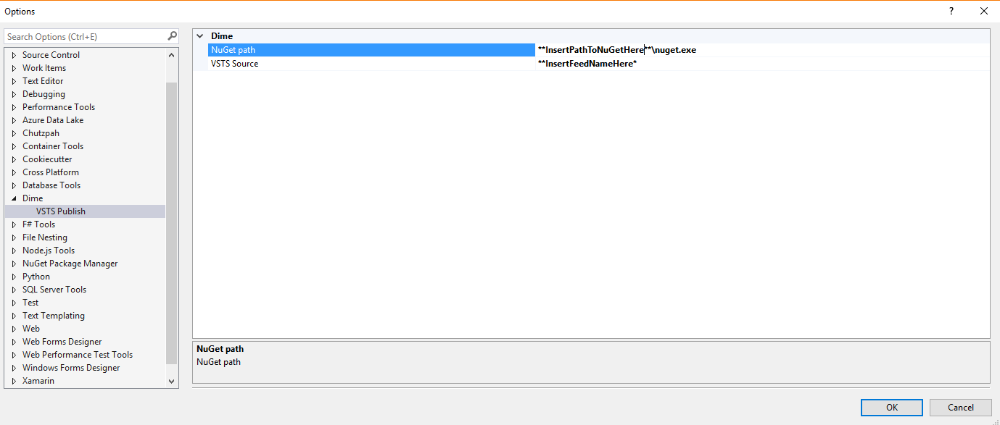

# Pack and Publish NuGet packages to VSTS package feed

This repository contains code for a Visual Studio Extension to create a NuGet package for a `.csproj` file and to publish it to a [VSTS feed](https://docs.microsoft.com/en-us/vsts/package/get-started-nuget).

## Prerequisites

- There is an existing feed at your disposal on VSTS.
- `nuget.exe` exists on the local machine.
- `CredentialProvider.VSS.exe` exists on the local machine

# Getting started

1) Install the extension on your Visual Studio 2017 instance.
2) Go to Tools -> Options and update the values as suggested by default:
   
3) Build the project in `Release` mode (ensure the binaries are located in the relative bin\Release folder of your project)
4) Open the context menu for the project and enter 'Publish to VSTS'
5) You may be requested to provide credentials (therefore the need of the `CredentialProvider.VSS` file)
6) You will see two dialog windows popping up but they will automatically close.
7) If everything succeeded you should now have your package in the VSTS feed
